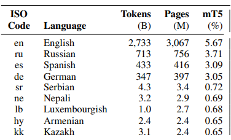

# SPA_projekat
Изградити модел машинског превођења који може да преводи текст са једног језика на други.

# Структуре података и алгоритми 
Изградити модел машинског превођења који може да преводи текст са једног језика на други

Трансформатори су врста језичких модела који се користе за обраду природног језика. Они су први пут представљени 2017. године.
Трансформатори се заснивају на концепцији self-attention, која омогућава моделу да учита и одговори на различите делове текста у исто време. Ово им даје предност у односу на претходне језичке моделе, који су се могли фокусирати само на један део текста у једном тренутку.

Трансформатори су се показали веома ефикасним у широком спектру задатака обраде природног језика, укључујући: Превод,, резиме, одговоре на питања, генерисање текста, основе трансформатора.

Архитектура трансформатора

Трансформатори се обично састоје од неколико секвенционалних слојева, који су раздвојени једним или више аттенционих слојева. Ово омогућава моделу да учи сложеније обрасце у тексту.

Еволуција трансформатора

Од свог првог представљања 2017. године, трансформатори су се значајно развили. Најважније побољшање је увођење конвергентних трансформатора. Конвергентни трансформатори су ефикаснији од конвенционалних трансформатора јер користе мање параметара.

Трансформатори су се показали веома успешним у широком спектру задатака обраде природног језика. Они су постали стандардна технологија за ове задатке и настављају да се развијају.

Трансформатори су моћна технологија која је револуционисала област обраде природног језика. Они су постали стандардна технологија за многе задатке обраде природног језика и настављају да се развијају.

**mT5 (Мултијезички Текст-у-Текст Трансформер)**

Jе напредни модел за обраду текста развијен од стране Google AI Language тима. Овај модел је специфично дизајниран за рад с текстом на више језика и има способност превођења, генерисања текста и других језичких задатака. Основна идеја mT5 је "text-to-text" приступ, где се различити језички задаци формулишу као задаци превода. Ово омогућава једноставну и конзистентну архитектуру која показује изузетне перформансе на различитим језицима и задацима обраде текста. Овај модел се истиче као моћан алат за решавање комплексних задатака у области обраде језика.

Слика приказује разлику између великог и малог мТ5 модела за обраду текста. Велики модел има више чворова од малог модела, што му омогућава да учи сложеније обрасце у тексту. Ово се може видети на графикону, где је процентуални удео незаконитих и незаконитих излаза мањи за велики модел од малог модела за све језике.
На пример, за језик енглески, процентуални удео незаконитих излаза за мали модел је 70%, док је за велики модел 40%. Ово значи да је мали модел 30% вероватније да ће генерисати незаконит излаз од великог модела.
Ова разлика у перформансама је значајна за задатке обраде текста који захтевају висок ниво тачности, као што су превод, резиме и одговори на питања.

Ево неких додатних детаља о слици:

- Графикон приказује удео незаконитих излаза за велики (a) и мали (b) mT5 модел за 10 различитих језика.
- Нетачни су они који су граматички или семантички нетачни.
- Незаконити излази су они који су граматички тачни, али семантички нетачни.
- Незаконити после норме су они који су граматички и семантички исправни након што су обрађени алгоритмом нормализације.

 
 

Колона „мТ5“ означава проценат података о обуци мТ5 који долазе из датог језика, користећи подразумевану вредност експоненцијалног изглађивања од α=0,3.

mT5-Small је далеко најмањи и самим тиме и  најнепрецизнији у односу на остале мТ5 пакете који постоје. Гуглов сервис Колаб има ограничења приликом рада у њему, па је највећи пакет који је могуће покренути јесте mT5-Small.

# Примјер превођења

# Литературе које су кориштене:

<https://jalammar.github.io/illustrated-transformer/>

<https://arxiv.org/pdf/2010.11934.pdf>
